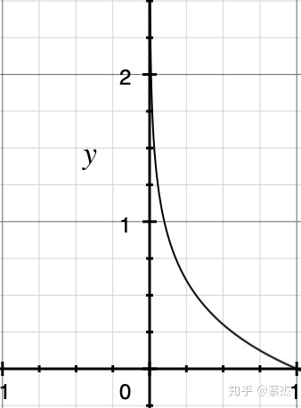

1. arg min的意思：arg min 就是使后面这个式子达到最小值时的x，t的取值，如：

   ```
   min L(w, b) + R(w)，是指要取损失函数 L(w, b) + R(w)的最小值
   （w`,b`）= argmin L(w, b) + R(w)，是指w`和b`是使损失函数L(w, b) + R(w)最小时的w和b值
   ```

   <br><br>

2. 信息量公式： $I(x_0)=-log(p(x_0))$，图像如下图：
   

   一条信息的信息量大小和它的不确定性有很大的关系。一句话如果需要很多外部信息才能确定，我们就称这句话的信息量比较大。比如你听到“云南西双版纳下雪了”，那你需要去看天气预报、问当地人等等查证（因为云南西双版纳从没下过雪）。相反，如果和你说“人一天要吃三顿饭”，那这条信息的信息量就很小，因为条信息的确定性很高。所以，信息量公式的图像中，$p(x_0)$越大，表示越确定，信息量也就越小，即$I$值越小；<br><br>

3. 