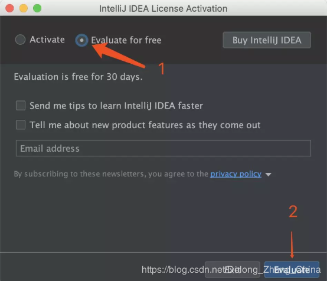
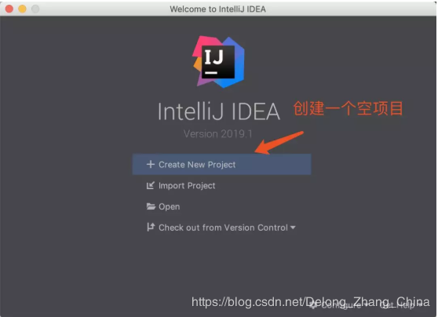
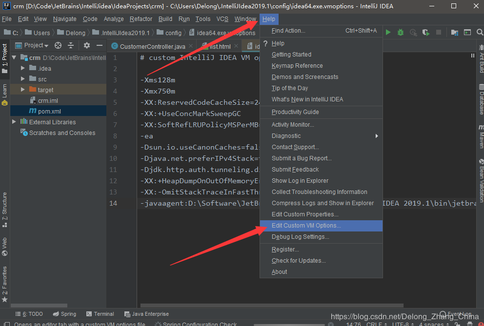
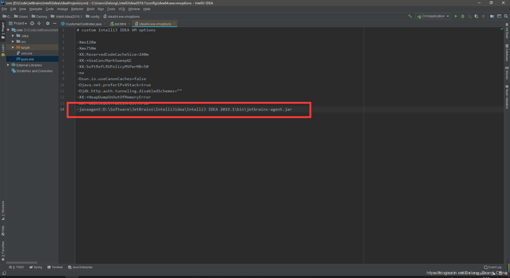
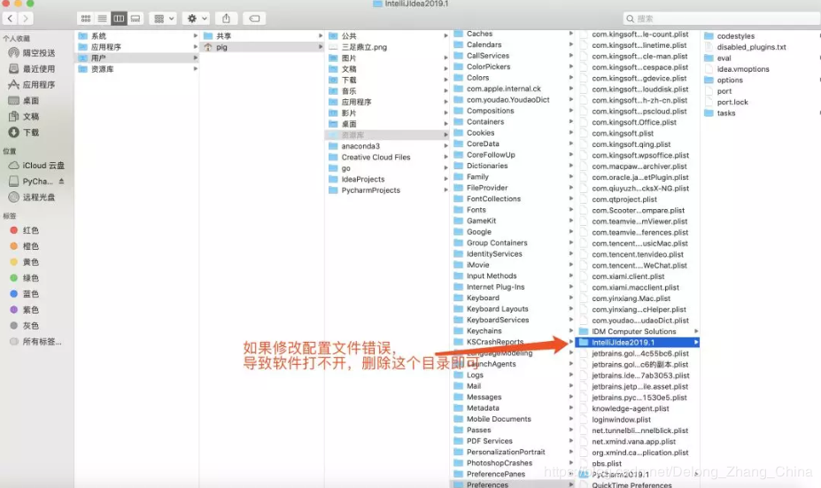
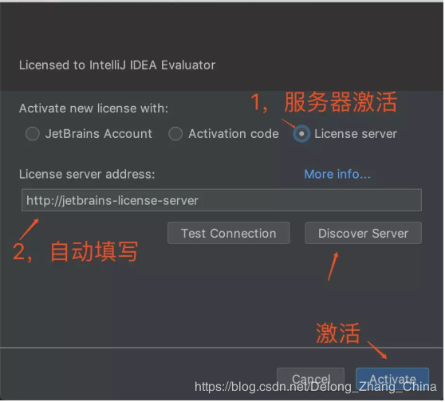
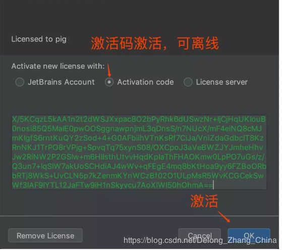

###JetBrains系列的永久破解方法
随着2019版的到来，之前的永久激活教程也不生效了，所以今天为大家带来一种新的Idea永久激活方式，本教程适用Windows、Mac、Ubuntu等所有平台。

###激活前准备工作

- 配置文件修改已经不在bin目录下直接修改，而是通过Idea修改

- 如果输入code一直弹出来，请去hosts里移除jetbrains相关的项目

  
### 激活前必下软件
- JetBrains的各类软件及破解补丁（与下面的补丁一样任选其一）
    链接：https://share.weiyun.com/5ZVSrQ9 密码：Delong

1.下载新版破解补丁
    点击链接 https://pan.baidu.com/s/16ALpz_BCXjsRkpS_PtD23A 或阅读原文下载补丁文件 jetbrains-agent.jar 并将它放置到 Idea安装目录的\bin目录下（位置可随意，放这里是怕误操作删除了破解文件）。（已下载）

2.进入项目界面
如果你之前已经使用有效期激活过可跳过此步骤，如果你是刚下载的Idea，则需要点击激活窗口的“Evaluate for free”免费试用，然后再创建一个空项目，这样就可以进入到Idea的工作页面。

3.修改配置文件

  - 进入到项目界面后，点击Idea最上面的菜单栏中的 “Help” -> “Edit Custom VM Options …”，如果提示是否要创建文件，请点”Yes”。
    

  - 在打开的vmoptions编辑窗口末行添加：-javaagent:你idea的安装目录\jetbrains-agent.jar
    

  - 请仔细检查补丁路径是否正确，如果错误则会出现Idea打不开的情况，这时候可以删除用户配置目录下的Idea文件夹:
    windwos：C:\Users\用户名
    macos：~/Library/Preferences/
    ubuntu：~/.
    

  - 修改完配置文件之后重启Idea

  - 修改完配置文件之后重启Idea

  - 修改完配置文件之后重启Idea

4. 输入激活码
   - 重启Idea之后，点击菜单栏中的 “Help” -> “Register …”，这里有两种激活方式：

  一、选择最后一种License server激活方式，地址填入：http://jetbrains-license-server （应该会自动填上），或者点击按钮：”Discover Server”来自动填充地址，完成激活

  二、如果服务器激活方式无法激活，还可以选择Activation code方式激活，复制下面激活码即可

秘钥：
D6KY031L1G-eyJsaWNlbnNlSWQiOiJENktZMDMxTDFHIiwibGljZW5zZWVOYW1lIjoi5o6I5p2D5Luj55CG5ZWGOiB3d3cuaTkub3JnIiwiYXNzaWduZWVOYW1lIjoiIiwiYXNzaWduZWVFbWFpbCI6IiIsImxpY2Vuc2VSZXN0cmljdGlvbiI6IiIsImNoZWNrQ29uY3VycmVudFVzZSI6ZmFsc2UsInByb2R1Y3RzIjpbeyJjb2RlIjoiSUkiLCJmYWxsYmFja0RhdGUiOiIyMDE5LTA3LTIyIiwicGFpZFVwVG8iOiIyMDIwLTA3LTIxIn0seyJjb2RlIjoiQUMiLCJmYWxsYmFja0RhdGUiOiIyMDE5LTA3LTIyIiwicGFpZFVwVG8iOiIyMDIwLTA3LTIxIn0seyJjb2RlIjoiRFBOIiwiZmFsbGJhY2tEYXRlIjoiMjAxOS0wNy0yMiIsInBhaWRVcFRvIjoiMjAyMC0wNy0yMSJ9LHsiY29kZSI6IlBTIiwiZmFsbGJhY2tEYXRlIjoiMjAxOS0wNy0yMiIsInBhaWRVcFRvIjoiMjAyMC0wNy0yMSJ9LHsiY29kZSI6IkdPIiwiZmFsbGJhY2tEYXRlIjoiMjAxOS0wNy0yMiIsInBhaWRVcFRvIjoiMjAyMC0wNy0yMSJ9LHsiY29kZSI6IkRNIiwiZmFsbGJhY2tEYXRlIjoiMjAxOS0wNy0yMiIsInBhaWRVcFRvIjoiMjAyMC0wNy0yMSJ9LHsiY29kZSI6IkNMIiwiZmFsbGJhY2tEYXRlIjoiMjAxOS0wNy0yMiIsInBhaWRVcFRvIjoiMjAyMC0wNy0yMSJ9LHsiY29kZSI6IlJTMCIsImZhbGxiYWNrRGF0ZSI6IjIwMTktMDctMjIiLCJwYWlkVXBUbyI6IjIwMjAtMDctMjEifSx7ImNvZGUiOiJSQyIsImZhbGxiYWNrRGF0ZSI6IjIwMTktMDctMjIiLCJwYWlkVXBUbyI6IjIwMjAtMDctMjEifSx7ImNvZGUiOiJSRCIsImZhbGxiYWNrRGF0ZSI6IjIwMTktMDctMjIiLCJwYWlkVXBUbyI6IjIwMjAtMDctMjEifSx7ImNvZGUiOiJQQyIsImZhbGxiYWNrRGF0ZSI6IjIwMTktMDctMjIiLCJwYWlkVXBUbyI6IjIwMjAtMDctMjEifSx7ImNvZGUiOiJSTSIsImZhbGxiYWNrRGF0ZSI6IjIwMTktMDctMjIiLCJwYWlkVXBUbyI6IjIwMjAtMDctMjEifSx7ImNvZGUiOiJXUyIsImZhbGxiYWNrRGF0ZSI6IjIwMTktMDctMjIiLCJwYWlkVXBUbyI6IjIwMjAtMDctMjEifSx7ImNvZGUiOiJEQiIsImZhbGxiYWNrRGF0ZSI6IjIwMTktMDctMjIiLCJwYWlkVXBUbyI6IjIwMjAtMDctMjEifSx7ImNvZGUiOiJEQyIsImZhbGxiYWNrRGF0ZSI6IjIwMTktMDctMjIiLCJwYWlkVXBUbyI6IjIwMjAtMDctMjEifSx7ImNvZGUiOiJSU1UiLCJmYWxsYmFja0RhdGUiOiIyMDE5LTA3LTIyIiwicGFpZFVwVG8iOiIyMDIwLTA3LTIxIn1dLCJoYXNoIjoiMTM3ODQzMjAvMCIsImdyYWNlUGVyaW9kRGF5cyI6NywiYXV0b1Byb2xvbmdhdGVkIjpmYWxzZSwiaXNBdXRvUHJvbG9uZ2F0ZWQiOmZhbHNlfQ==-hBov92HEvNGvBzS2z190KAPxc9F6XY6jT1daMLlPrpCSEAdQX/955WkyGz+hCa3w/aeNExMEZIv2tALkFDOt857w4PZM8oYZ07s7My1NL7DxX9coFswbC6IIBijkAne9cPV9fSnGt5XcfsAkrF8KW1gj21H4EZGR6Jm4Cn7/j37rG1ASu2uvdoJ4dgCicfi78fvIw+zVvGm7L4cMjsmsilNNrUFPpDuVCp2kfU2ncDWm/M0lu+Dfeo3UO61/ICs9FvYAw0V4d8Q6pExzoqbAGH0IgkrHKJ2YQpKKOz3/+w4SGKhAX+85XYmfmLcUoqAZWaI95yhXN/czf/eeAf3ZEg==-MIIElTCCAn2gAwIBAgIBCTANBgkqhkiG9w0BAQsFADAYMRYwFAYDVQQDDA1KZXRQcm9maWxlIENBMB4XDTE4MTEwMTEyMjk0NloXDTIwMTEwMjEyMjk0NlowaDELMAkGA1UEBhMCQ1oxDjAMBgNVBAgMBU51c2xlMQ8wDQYDVQQHDAZQcmFndWUxGTAXBgNVBAoMEEpldEJyYWlucyBzLnIuby4xHTAbBgNVBAMMFHByb2QzeS1mcm9tLTIwMTgxMTAxMIIBIjANBgkqhkiG9w0BAQEFAAOCAQ8AMIIBCgKCAQEAxcQkq+zdxlR2mmRYBPzGbUNdMN6OaXiXzxIWtMEkrJMO/5oUfQJbLLuMSMK0QHFmaI37WShyxZcfRCidwXjot4zmNBKnlyHodDij/78TmVqFl8nOeD5+07B8VEaIu7c3E1N+e1doC6wht4I4+IEmtsPAdoaj5WCQVQbrI8KeT8M9VcBIWX7fD0fhexfg3ZRt0xqwMcXGNp3DdJHiO0rCdU+Itv7EmtnSVq9jBG1usMSFvMowR25mju2JcPFp1+I4ZI+FqgR8gyG8oiNDyNEoAbsR3lOpI7grUYSvkB/xVy/VoklPCK2h0f0GJxFjnye8NT1PAywoyl7RmiAVRE/EKwIDAQABo4GZMIGWMAkGA1UdEwQCMAAwHQYDVR0OBBYEFGEpG9oZGcfLMGNBkY7SgHiMGgTcMEgGA1UdIwRBMD+AFKOetkhnQhI2Qb1t4Lm0oFKLl/GzoRykGjAYMRYwFAYDVQQDDA1KZXRQcm9maWxlIENBggkA0myxg7KDeeEwEwYDVR0lBAwwCgYIKwYBBQUHAwEwCwYDVR0PBAQDAgWgMA0GCSqGSIb3DQEBCwUAA4ICAQAF8uc+YJOHHwOFcPzmbjcxNDuGoOUIP+2h1R75Lecswb7ru2LWWSUMtXVKQzChLNPn/72W0k+oI056tgiwuG7M49LXp4zQVlQnFmWU1wwGvVhq5R63Rpjx1zjGUhcXgayu7+9zMUW596Lbomsg8qVve6euqsrFicYkIIuUu4zYPndJwfe0YkS5nY72SHnNdbPhEnN8wcB2Kz+OIG0lih3yz5EqFhld03bGp222ZQCIghCTVL6QBNadGsiN/lWLl4JdR3lJkZzlpFdiHijoVRdWeSWqM4y0t23c92HXKrgppoSV18XMxrWVdoSM3nuMHwxGhFyde05OdDtLpCv+jlWf5REAHHA201pAU6bJSZINyHDUTB+Beo28rRXSwSh3OUIvYwKNVeoBY+KwOJ7WnuTCUq1meE6GkKc4D/cXmgpOyW/1SmBz3XjVIi/zprZ0zf3qH5mkphtg6ksjKgKjmx1cXfZAAX6wcDBNaCL+Ortep1Dh8xDUbqbBVNBL4jbiL3i3xsfNiyJgaZ5sX7i8tmStEpLbPwvHcByuf59qJhV/bZOl8KqJBETCDJcY6O2aqhTUy+9x93ThKs1GKrRPePrWPluud7ttlgtRveit/pcBrnQcXOl1rHq7ByB8CFAxNotRUYL9IF5n3wJOgkPojMy6jetQA5Ogc8Sm7RG6vg1yow==

5.查看有效期

- 当你激活完毕后，Idea右下角会有个Registration小长条提示框，大致的内容为：You copy is Licensed to XXX意思就会告诉你：兄弟，你已经激活成功了，激活码的许可来源是：XXX。

- 查看有效期的步骤为点击：Help->About这里可以看到你的Idea的版本号、许可来源、有效期、以及一些环境

- 服务器激活是没有期限的，即为永久有效

- 激活码激活的有效期到2089年的