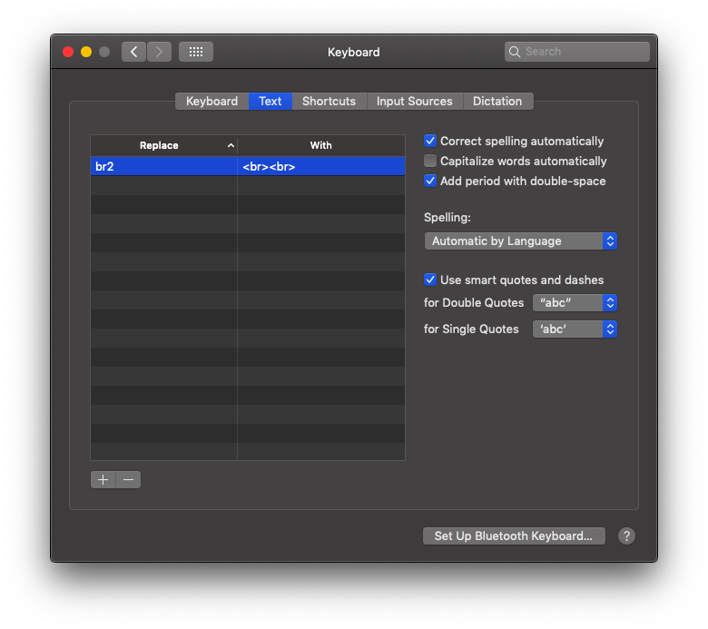

1. 当有多个桌面，如桌面1是微信，桌面2是谷歌浏览器，桌面3是编辑器时，如果在桌面3，然后点击微信图标，则会跳到桌面1，微信仍然是桌面1，但是编辑器变成了桌面2！！！？？？在系统设置-》调度中心 可找到“根据最近使用情况重新排列空间”的选项，把勾去掉即可；   

2. 可以利用mac的text的replace功能来自定义自己的编辑快捷输入，设置在“系统设置=》键盘=》TEXT”，点击左下角的“+”号可添加规则，比如我添加的规则如下图：
   

   这样就可以设置自定义的编辑单词了，但是在vscode下面好像没用；   

3. 图片区域截图快捷键是ctrl+shift+command+4，然后可以选区域，如果就是当前窗口，则加按一个空格键，就可以了，这时候会截屏到剪贴板，然后在微信或其他文本编辑器上黏贴，如果按的是shift+command+4则是截屏后在右下角会有一个截图缩略图出来，按一下就弹到截图编辑上了；   

4. 不要每次brew install xxx 都update：`vim ~/.bash_profile`，最后一行加入：`export HOMEBREW_NO_AUTO_UPDATE=true`，就可以了；   

5. 