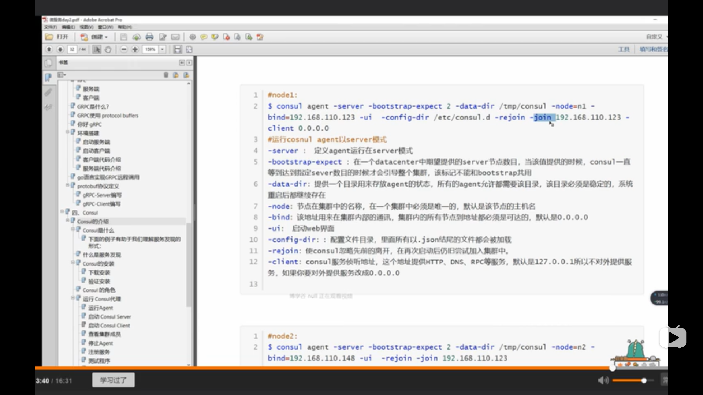
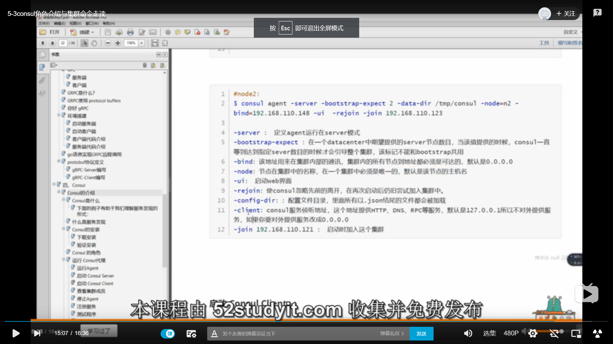
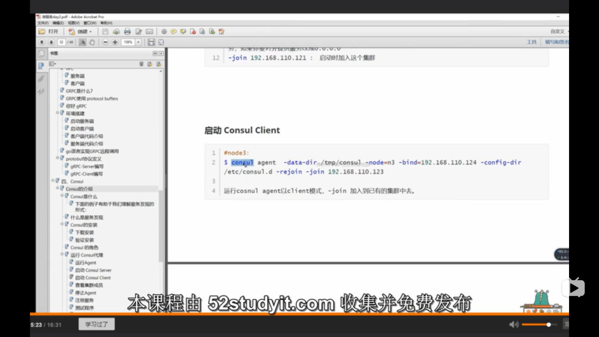

### consul部署

- docker命令（在同一台机部署多个consul的时候才要用）：

  ```
  //创建第一个节点，其他server或client节点的创建都一样，只是挂载目录/d/consul/xxx要换一下，主节点-p为8500，其它节点可以换成8600:8500等
  docker run -it --name node1 --network learn_micro --network-alias node1  -v /d/consul/node1/consul:/tmp/consul -v /d/consul/node1/consul.d:/etc/consul.d -v /d/Documents/my_projects/learn_micro:/root/projects/learn_micro  -p 8500:8500 286142377/go_ubuntu_micro:0.9 /bin/bash
  ```

- consul命令：

  ```shell
  //容器里面跑consul，172.22.0.2是这个容器的docker分配的ip,以下是同一台机器的部署，如果是局域网中多台机器，则需要换成局域网内对应的ip
  //node1:
  consul agent -server -bootstrap-expect 2  -enable-local-script-checks -data-dir /tmp/consul -node=n1 -bind=172.22.0.2 -ui -config-dir /etc/consul.d -rejoin -retry-join 172.22.0.2 -client 0.0.0.0
  // -join 172.22.0.2是说加入主服务器的这个集群中
  
  //node2:
  consul agent -server -bootstrap-expect 2  -enable-local-script-checks -data-dir /tmp/consul -node=n1 -bind=172.22.0.3 -ui -config-dir /etc/consul.d -rejoin -retry-join 172.22.0.2 -client 0.0.0.0
  
  //client:
  consul agent -data-dir /tmp/consul -node=n3 -enable-local-script-checks -bind=172.22.0.4 -config-dir /etc/consul.d -rejoin -retry-join 172.22.0.2
  ```
  
- consul api:` go get -v github.com/hashicorp/consul`；<br><br>


命令解释见下图：

node1:



node2:



client:



### 服务注册

- 在consul.d文件夹中新建json配置文件：

  ```json
  {
  	"service": {
  		"name": "web1",  #服务名称
  		"tags": ["master"],  #标记
  		"address": "127.0.0.1",  #ip
  		"port": 10000,
  		"checks": [
  			{
  				"http": "http://localhost:10000/health",
  				"interval": "10s"  # 检查时间间隔
  			}
  		]
  	}
  }
  ```

- server最好有奇数个，这样选举比较容易

 