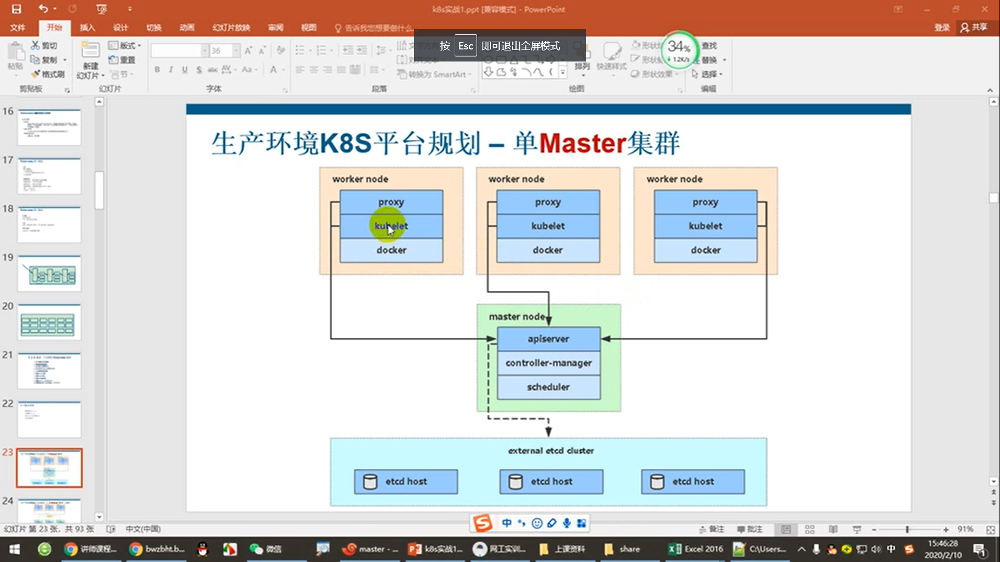
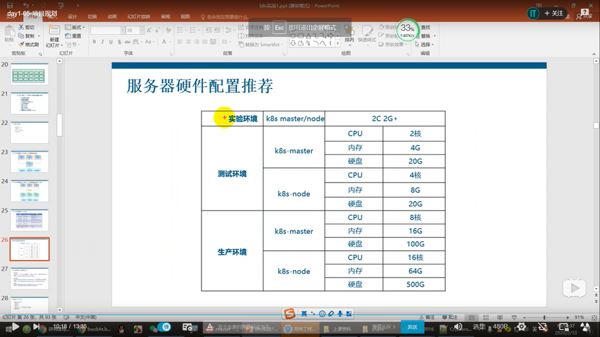

# k8s部署步骤

1. 单master集群（生产环境不推荐，生产环境要至少3个master）：
   示意图：
   
   
   <br><br>
   
2. 多master集群：
   示意图：
   

   <br><br>
   
3. 硬件配置：
   
   
   <br><br>
   
4. 各组件作用：

   - 架构：
     

     备注：我的理解是，我们的app具体的服务是部署到worker中的，每个worker有多个pod，运行不同的服务，比如某个pod运行gin框架监听http，某个pod运行grpc的server，某个pod运行mongodb等，每个woker的多个pod加起来就是我们整个完整的app，通过kube-proxy或路由器做负载均衡，

   - master组件：
     
   - worker组件：
     

### 搭建单master集群步骤（ubuntu20.04 server)

- 初始化服务器

  - 关闭防火墙：`sudo ufw disable`，虽然默认是关闭，但是也执行一下；

  - 关闭交换分区：`sudo vim /etc/fstab` 将有swap的那一行注释掉，重启即可，看看free -m，swap那一行是不是0，是0的话就说明关闭成功了；

  - 配置主机名：`hostnamectl set-hostname k8s-master1`，最后的那个k8s-master1就是主机名，之所以要配置，就是为了能分清是哪个主机，这个主机用来干嘛的，用`hostname`命令可以查看有没有修改成功；

  - 配置名称解析：`sudo vim /etc/hosts`，在里面加入ip和集群中对应的其他主机的主机名，这样就可以ping主机名来与其他主机通信了；

  - 如果是不联外网的状态，还要配置时间服务器进行时间同步，这里不再讲解；

- 安装SSL证书（涉及的安装文件或者json文件我是都统一放到 ~/etcd文件夹下，**每个etcd和master节点**下都要安装SSL证书和签证机构）

  - 自建签证机构（CA）：
  
    ```shell
    # wget https://pkg.cfssl.org/R1.2/cfssl_linux-amd64
    # wget https://pkg.cfssl.org/R1.2/cfssljson_linux-amd64
    # wget https://pkg.cfssl.org/R1.2/cfssl-certinfo_linux-amd64
    # chmod +x cfssl_linux-amd64 cfssljson_linux-amd64 cfssl-certinfo_linux-amd64
    # mv cfssl_linux-amd64 /usr/local/bin/cfssl
    # mv cfssljson_linux-amd64 /usr/local/bin/cfssljson
    # mv cfssl-certinfo_linux-amd64 /usr/bin/cfssl-certinfo
    ```
  
  - 我的位置在~/etcd下，三个json文件创建：
  
    ```
    # cat ca-config.json
    {
      "signing": {
        "default": {
          "expiry": "87600h"
        },
        "profiles": {
          "www": {
             "expiry": "87600h",
             "usages": [
                "signing",
                "key encipherment",
                "server auth",
                "client auth"
            ]
          }
        }
      }
    }
    
    # cat ca-csr.json
    {
        "CN": "etcd CA",
        "key": {
            "algo": "rsa",
            "size": 2048
        },
        "names": [
            {
                "C": "CN",
                "L": "Beijing",
                "ST": "Beijing"
            }
        ]
    }
    
    # cat server-csr.json
    # 注意！！！！虽然"hosts"填的是master和worker节点的ip，但是实际上这个代表的是etcd所在主机ip，因为我们这一步是给etcd颁发证书，"CN"可以看出，是给etcd颁发证书的
    # 如果etcd分开另外部署，则这里的hosts就要填写实际的etcd所在ip了
    {
        "CN": "etcd",
        "hosts": [
        "192.168.9.213",
        "192.168.9.214",
        "192.168.9.215"
        ],
        "key": {
            "algo": "rsa",
            "size": 2048
        },
        "names": [
            {
                "C": "CN",
                "L": "BeiJing",
                "ST": "BeiJing"
            }
        ]
    }
    ```
  
  - 生成证书命令行:
  
    ```shell
    $cfssl gencert -initca ca-csr.json | cfssljson -bare ca -
    $cfssl gencert -ca=ca.pem -ca-key=ca-key.pem -config=ca-config.json -profile=www server-csr.json | cfssljson -bare server
    $ls *pem（应该有4个pem结尾的文件）
    ca-key.pem  ca.pem  server-key.pem  server.pem
    # 两个ca开头的，是CA自己的证书，而server开头的，则是etcd的证书
    # 有key和没有key的相同开头的两个，是一对公钥私钥
    ```
  
- 部署etcd（安装包下载地址：wget https://github.com/etcd-io/etcd/releases/download/v3.4.7/etcd-v3.4.7-linux-amd64.tar.gz）：
  
  - 解压可执行文件到/opt/etcd/bin:
  
    ```shell
    mkdir /opt/etcd/{bin,cfg,ssl} -p
    tar -zxvf etcd-v3.4.7-linux-amd64.tar.gz -C ./
    mv etcd-v3.4.7-linux-amd64/{etcd,etcdctl} /opt/etcd/bin/
    ```
  
  -  创建etcd配置文件 `vim /opt/etcd/cfg/etcd`，加入以下内容，完后`chmod 777 /opt/etcd/cfg/etcd`：
  
    ```
    #[Member]
    ETCD_NAME="etcd1"  # 这里设置了etcd1，那么下面的ETCD_INITIAL_CLUSTER中的名字要对得上
    ETCD_DATA_DIR="/var/lib/etcd/default.etcd"
    ETCD_LISTEN_PEER_URLS="https://192.168.18.80:2380"
    ETCD_LISTEN_CLIENT_URLS="https://192.168.18.80:2379"
    
    #[Clustering]
    ETCD_INITIAL_ADVERTISE_PEER_URLS="https://192.168.18.80:2380"
    ETCD_ADVERTISE_CLIENT_URLS="https://192.168.18.80:2379"
    ETCD_INITIAL_CLUSTER="etcd1=https://192.168.18.80:2380,etcd2=https://192.168.18.85:2380,etcd3=https://192.168.18.86:2380"
    ETCD_INITIAL_CLUSTER_TOKEN="etcd-cluster"
    ETCD_INITIAL_CLUSTER_STATE="new"
    ```
  
  - 创建etcd.service，这是个开机启动脚本，`vim /usr/lib/systemd/system/etcd.service`，加入：
  
    ```
    [Unit]
    Description=Etcd Server
    After=network.target
    After=network-online.target
    Wants=network-online.target
    
    [Service]
    Type=notify
    EnvironmentFile=/opt/etcd/cfg/etcd
    ExecStart=/opt/etcd/bin/etcd \
    --name=${ETCD_NAME} \
    --data-dir=${ETCD_DATA_DIR} \
    --listen-peer-urls=${ETCD_LISTEN_PEER_URLS} \
    --listen-client-urls=${ETCD_LISTEN_CLIENT_URLS},http://127.0.0.1:2379 \
    --advertise-client-urls=${ETCD_ADVERTISE_CLIENT_URLS} \
    --initial-advertise-peer-urls=${ETCD_INITIAL_ADVERTISE_PEER_URLS} \
    --initial-cluster=${ETCD_INITIAL_CLUSTER} \
    --initial-cluster-token=${ETCD_INITIAL_CLUSTER_TOKEN} \
    --initial-cluster-state=new \
    --cert-file=/opt/etcd/ssl/server.pem \
    --key-file=/opt/etcd/ssl/server-key.pem \
    --peer-cert-file=/opt/etcd/ssl/server.pem \
    --peer-key-file=/opt/etcd/ssl/server-key.pem \
    --trusted-ca-file=/opt/etcd/ssl/ca.pem \
    --peer-trusted-ca-file=/opt/etcd/ssl/ca.pem
    Restart=on-failure
    LimitNOFILE=65536
    
    [Install]
    WantedBy=multi-user.target
    ```
  
  - 将之前生成的证书拷贝到固定的目录 :
  
    ### 注意！！！！！！！先在一个节点生成.pem文件，后续节点千万不要自行再生成.pem文件了，而是把第一个节点生成的.pem文件复制过来！！！！！！
  
    ```shell
    cp ca* pem server*pem /opt/etcd/ssl
    ```
  
  -  启动并设置开机启动 ，注意，在etcd的配置文件中，有几个节点的，只要这几个节点没启动，那么这个start命令就会卡住，所以，一个节点执行完start，其他节点也要执行start，最后全部节点都要执行enable:
  
    ```shell
    systemctl start etcd
    systemctl enable etcd
    ```
    
    执行start命令的时候如出现以下错误：` etcd: conflicting environment variable "ETCD_NAME" is shadowed by corresponding command-line flag (either unset environment variable or disable flag) `，那么可能是你的etcd版本是3.4或以上，因为 ETCD3.4版本会自动读取环境变量的参数，所以EnvironmentFile文件中有的参数，不需要再次在ExecStart启动参数中添加，二选一，如同时配置 ，就会出现上述错误，所以，`/usr/lib/systemd/system/etcd.service`，重新改成：
    
    ```
    [Unit]
    Description=Etcd Server
    After=network.target
    After=network-online.target
    Wants=network-online.target
    
    [Service]
    Type=notify
    EnvironmentFile=/opt/etcd/cfg/etcd
    ExecStart=/opt/etcd/bin/etcd \
    --initial-cluster-state=new \
    --cert-file=/opt/etcd/ssl/server.pem \
    --key-file=/opt/etcd/ssl/server-key.pem \
    --peer-cert-file=/opt/etcd/ssl/server.pem \
    --peer-key-file=/opt/etcd/ssl/server-key.pem \
    --trusted-ca-file=/opt/etcd/ssl/ca.pem \
    --peer-trusted-ca-file=/opt/etcd/ssl/ca.pem
    Restart=on-failure
    LimitNOFILE=65536
    
    [Install]
    WantedBy=multi-user.target
    ```
    
    
    
  -  在都部署完成后，检查一下集群的状态(若是出现cluster is healthy，说明部署成功！) 
  
    ```shell
    /opt/etcd/bin/etcdctl --ca-file=/opt/etcd/ssl/ca.pem --cert-file=/opt/etcd/ssl/server.pem --key-file=/opt/etcd/ssl/server-key.pem --endpoints="https://192.168.18.80:2379,https://192.168.18.85:2379,https://192.168.18.86:2379" cluster-health
    ```
  
  
  
  
  
  
  
    
  
    