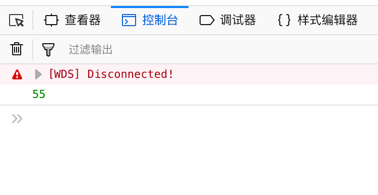
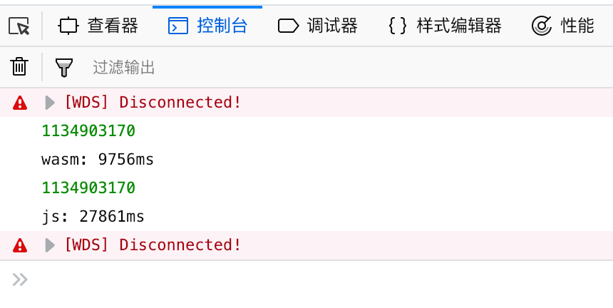

## WASM 简介

WebAssembly 是一种简单机器模型下的执行格式，其具有一个扩展规范。

WebAssembly 并未和 JS 或者 Web 绑定；也没有预设其宿主环境。 因此也有理由假设 wasm 将会成为重要的跨环境“可移植执行体”格式。 可以这么说：今时今日，wasm 的确和 JS 关系重大，这是因为收到了多方的青睐（浏览器和 Node.js）。

WebAssembly 只有很小的一个值类型集合，基本上限制在简单数值的范围内。

WebAssembly 具有非常简单的内存模型。 目前，wasm 可以接入一个非常简单的“线性内存”，其基本上就是一块扁平的定长数字型数组。 这个内存可以以一个页大小的倍数增长，但不能缩减（shrink）。

总之，WASM 的特点是：**体积小巧、运行高效、跨平台**。

## Rust 简介

由于 WASM 是静态类型，因此很难直接使用我们熟悉的 JavaScript来直接编写，目前的 WASM 都是通过其他静态语言编译而来。

目前支持 WASM 的语言有 C++、Rust、Go等。其中 Rust 对 WASM 的支持度相对完善，社区活跃度也非常高。

Rust 是 Mozilla 开发的一门静态的支持多种范式的系统编程语言。 它有着**惊人的运行速度，能够防止内存错误，并保证线程安全**。 感兴趣的可以参考 Rust 官网：https://www.rust-lang.org/zh-CN/

另外，Rust 在 WASM 生态颇有建树，如 [wasm-bindgen](https://github.com/rustwasm/wasm-bindgen)、[stdweb](https://github.com/koute/stdweb)等轮子使得我们编写 WASM 应用更加容易。

## 安装 Rust 工具链

Rust 工具链包括：

- rustup：负责安装 Rust、切换 Rust 版本、下载标准库文件等
- rustc：Rust 的编译器（一般通过 Cargo 命令调用）
- cargo：Rust 的项目管理工具（类似 Node 的 NPM）

运行：`curl https://sh.rustup.rs -sSf | sh`即可安装

## 安装 WASM 工具链

wasm-pack 用于将 Rust 项目打包成单个 WASM 文件（类似 Webpack），运行 `curl https://rustwasm.github.io/wasm-pack/installer/init.sh -sSf | sh`安装。

cargo-generate 用于快速生成 WASM 项目的脚手架（类似 create-react-app），运行 `cargo install cargo-generate`即可安装。

另外，还需要 Node 和 NPM，这里不再赘述。

## 创建一个 WASM 项目

首先运行 `cargo generate --git https://github.com/rustwasm/wasm-pack-template`，按照提示创建项目，项目名称设置为“web-assembly-demo”。

然后可以看到项目结构：

```
wasm-demo/
├── Cargo.toml
├── LICENSE_APACHE
├── LICENSE_MIT
├── README.md
└── src
    └── lib.rs
```

让我们来看一看项目目录：

### Cargo.toml：

Cargo.toml 类似于 Nodejs 的 package.json，用于标识项目的元信息、依赖等。其中的`crate-type`属性标识我们需要创建一个 WASM 模块。

### src/lib.rs：

该文件是项目的入口文件，这里我们实现一个计算斐波那契数列的递归函数：

```rust
extern crate wasm_bindgen; 

use wasm_bindgen::prelude::*;  

#[wasm_bindgen]
pub fn fib(i: u32) -> u32 {
    match i {
        0 => 0,
        1 => 1,
        _ => fib(i-1) + fib(i-2)
    }
}
```

得益于 Rust 的**元编程**能力，这里通过`#[wasm_bindgen]`函数标记（内部使用Rust宏实现）即可实现自动生成 WASM 的函数接口。

## 编译 WASM 模块

下项目下运行`wasm-pack build`命令，即可编译出 WASM 模块。wasm-pack会在项目的pkg目录下生成 .wasm 等文件。

## 运行 WASM 模块

`$cd pkg`

修改 package.json：

```json
{
  "name": "wasm-app",
  "version": "0.1.0",
  "main": "index.js",
  "scripts": {
    "build": "webpack --config webpack.config.js",
    "start": "webpack-dev-server"
  },
  "devDependencies": {
    "webpack": "^4.16.3",
    "webpack-cli": "^3.1.0",
    "webpack-dev-server": "^3.1.5",
    "copy-webpack-plugin": "^4.5.2"
  }
}
```

新建"webpack.config.js"，创建 Webpack 配置：

```c
const CopyWebpackPlugin = require("copy-webpack-plugin");
const path = require('path');

module.exports = {
  entry: "./bootstrap.js",
  output: {
    path: path.resolve(__dirname, "dist"),
    filename: "bootstrap.js",
  },
  mode: "development",
  plugins: [
    new CopyWebpackPlugin(['index.html'])
  ],
};
```

创建 index.html：

```html
<!DOCTYPE html>
<html>
  <head>
    <meta charset="utf-8">
    <title>Hello wasm-pack!</title>
  </head>
  <body>
    <noscript>This page contains webassembly and javascript content, please enable javascript in your browser.</noscript>
    <script src="./bootstrap.js"></script>
  </body>
</html>
```

创建 bootstrap.js：

```javascript
import("./index.js")
  .catch(e => console.error("Error importing `index.js`:", e));
```

创建 index.js，引入刚刚生成的 WASM ：

```javascript
import * as wasm from "./web_assembly_demo";

console.log(wasm.fib(20));
```

运行`npm install`，再运行`npm start`，即可看到我们的运行结果！ <br><br>



## Benchmark

修改index.js：

```javascript
import * as wasm from "./web_assembly_demo";

function fib(i) {
   if (i === 0)  return 0;
   if (i === 1)  return 1;
   return fib(i - 1) + fib(i - 2);
}

console.time('wasm');
console.log(wasm.fib(45));
console.timeEnd('wasm');

console.time('js');
console.log(fib(45));
console.timeEnd('js');
```

运行结果： 

可以看到，该算力在当前环境下，WASM 的速度接近 JS 的 **3 倍**！

由于目前各大浏览器还未对 WASM 专门做优化，在可以遇见的将来，WASM 的运行效率将会越来越高，对比 JS 的优势也会日渐凸显！

Rust 这种语言特性先进、无 GC 和 Runtime消耗、安全高效且工具链完善的语言也会在前端领域发挥更大的作用！

让我们拭目以待。